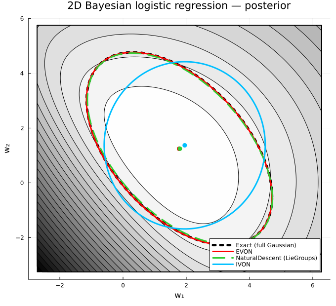

# NaturalOptimisers.jl

[](https://julialang.org)
[](https://opensource.org/licenses/MIT)
[](https://github.com/alexander/Postdoc/Projects/NaturalOptimisers.jl)



`NaturalOptimisers.jl` provides **variational learning** optimisers — natural-gradient and Newton-like rules that learn a Gaussian distribution over a model's weights instead of a point estimate. It plugs into the [`Optimisers.jl`](https://github.com/FluxML/Optimisers.jl) ecosystem: the variational distribution $q$ is stored *inside the optimiser state*, so any existing model becomes a Bayesian one without changing its structure.

## Optimisers

All three rules subtype `AbstractNaturalRule` and share one workflow — `setup` → `sample` weights from $q$ → take gradients at the sampled weights → `update`:

| Rule | Posterior it learns | Best for | Reference |
|------|---------------------|----------|-----------|
| **`NaturalDescent`** | diagonal **or** full Gaussian, via a choice of geometric manifold | exact / research variational inference | Khan et al. 2018; Lin et al. 2020/21; Kıral et al. 2023 |
| **`IVON`** | mean-field (diagonal) Gaussian, Adam-like | large models, parameters of any shape | Shen et al. 2024 |
| **`EVON`** | *structured* (Kronecker-factored) Gaussian | weight matrices, cheap structured uncertainty | Minut et al. 2026 |

The model's parameters are never mutated in place — the learned mean/covariance live in the optimiser state, and concrete weights are materialised on demand with `sample`.

## The variational objective

Each rule minimises a variational objective over a Gaussian $q$,

$$\mathcal{L}(q) = \zeta\,\mathbb{E}_{q}[\ell(\theta)] + \mathrm{KL}\big(q \,\|\, p\big),$$

where $\ell(\theta)$ is the loss (negative log-likelihood), $p$ is an isotropic Gaussian prior, and $\zeta$ scales the data term (the number of data points $N$ for exact Bayesian inference). For `NaturalDescent` the prior is folded into $\ell$ and the trade-off is written with a temperature $\tau\in[0,1]$: $\tau=1$ is exact Bayesian inference, $\tau=0$ collapses to MAP optimisation.

## Usage

### Basic training loop

The same loop works for `IVON`, `EVON`, and `NaturalDescent` (diagonal *and* full-covariance) — just swap the `rule`. Use any AD framework (Zygote, ForwardDiff, Enzyme) for the gradient at the sampled weights.

```julia
using NaturalOptimisers, Optimisers, Random

rng = MersenneTwister(0)
model = (W = zeros(4, 3),)                  # any Optimisers-compatible model (NamedTuple/struct/…)

rule = IVON(0.2, (0.9, 0.99); delta=1.0, lambda=10.0, init_scale=1.0)  # ← or EVON(...) / NaturalDescent(...; meanfield=true)
tree = Optimisers.setup(rule, model)

# A toy potential ℓ(W) = ½‖W − W★‖² (analytic gradient here; use your AD in practice):
Wstar = randn(rng, 4, 3)
∇loss(w) = (W = w.W .- Wstar,)

for _ in 1:2000
    w = sample(rng, model, tree)            # draw weights θ ~ q
    tree, model = Optimisers.update(tree, model, ∇loss(w))
end

m̄  = tree.W.state.q[1]                                       # posterior mean
σ² = 1 ./ (rule.lambda .* (tree.W.state.q[2] .+ rule.delta)) # posterior variance (IVON)
```

### Multiple Monte-Carlo samples (variance reduction)

Pass `num_samples` to `sample` and hand `update` the **vector** of per-sample gradients:

```julia
for _ in 1:2000
    ws    = sample(rng, model, tree; num_samples = 16)   # vector of 16 weight draws
    grads = [∇loss(w) for w in ws]                        # one gradient tree per sample
    tree, model = Optimisers.update(tree, model, grads)
end
```

### Mixed models (EVON for matrices, AdamW for the rest)

Following the SOAP-Bubbles paper, `EVON` is applied only to matrices; 1-D tensors and embeddings use a standard optimiser. The three-argument `setup` builds this mixed tree automatically:

```julia
model = (W = randn(rng, 256, 128), b = randn(rng, 256))   # a matrix and a bias

tree = Optimisers.setup(EVON(0.1; delta=1.0, zeta=1.0), Optimisers.AdamW(3e-4), model)
#   EVON on every ≥2-D parameter, AdamW on the 1-D ones

w = sample(rng, model, tree)               # SOAP-Bubble draw for W, point estimate for b
grad, = Zygote.gradient(loss, w)
tree, model = Optimisers.update(tree, model, grad)
```

### Bayesian model averaging at test time

`sample` materialises a fresh set of weights each call, so ensembling is a one-liner:

```julia
preds = [predict(sample(rng, model, tree)) for _ in 1:32]
ŷ = mean(preds)
```

## The optimisers in detail

### `NaturalDescent` — natural-gradient VI on a manifold

Learns a `DiagNormal` (`meanfield=true`) or `FullNormal` Gaussian by natural-gradient descent, with a choice of geometry for the scale/covariance parameter:

* **`LieGroupManifold`** — scale via a Cholesky factor $L$, updated by the matrix exponential of the affine Lie algebra so positive-definiteness is preserved exactly: $L_{t+1} = L_t \exp(-\eta U)$, $\;U = L^\top \mathbb{E}_q[\nabla_\theta\ell\,\epsilon^\top] - \tau I$ (Kıral et al. 2023).
* **`RiemannianManifold`** — precision $S=\Sigma^{-1}$ updated along Riemannian geodesics with a second-order correction that keeps $S\succ0$: $S_{t+1} = S_t - \eta\hat G + \tfrac{\eta^2}{2}\hat G\,\Sigma\,\hat G$ (Lin et al. 2020).
* **`EuclidianManifold`** — projected Euclidean updates using inverse-link functions (e.g. $\phi=\mathrm{softplus}^{-1}(\sigma)$) to enforce the scale constraint (Khan et al. 2018).

It also supports **natural momentum** (Adam-like EMAs computed in the natural-gradient/tangent space, with bias correction), set via `beta=(β₁, β₂)`. Both the diagonal (`meanfield=true`) and full-covariance (`meanfield=false`) variants plug into the tree workflow above and recover the exact posterior; the full-covariance ones also expose their per-leaf primitives directly:

```julia
rule  = NaturalDescent(0.01; tau=1.0, meanfield=false, manifold=RiemannianManifold())
state = Optimisers.init(rule, zeros(2))
update_epsilon!(rng, Optimisers.Leaf(rule, state))   # refresh the reparameterisation noise

z   = NaturalOptimisers.sample(rule, state, 1)       # draw weights from q
dx  = [∇loss(z)]                                      # per-sample gradient(s) at z
∇̃m, ∇̃S = natgrad(rule, state, dx)                    # natural gradient
m′, S′ = update(rule, state.q..., ∇̃m, ∇̃S)            # manifold retraction
```

### `IVON` — Improved Variational Online Newton

A mean-field rule with an Adam-like update (Shen et al. 2024). It learns $\mathcal{N}(\theta\mid m,\mathrm{diag}(\sigma^2))$ with $\sigma^2 = 1/(\lambda(h+\delta))$, where $h$ tracks the diagonal Hessian via the reparameterised estimator $\hat h = \hat g \odot \epsilon/\sigma$, $\delta$ is the prior precision / weight decay, and $\lambda$ the dataset scaling. It operates element-wise, so it works on parameters of any shape; it is the diagonal special case of `EVON`.

```julia
rule = IVON(0.1; delta=1.0, lambda=1.0, init_scale=0.01, init_mean=true)  # warm-start at the weights
```

### `EVON` — Eigenspace VON (SOAP-Bubbles)

Learns a *structured*, non-diagonal Gaussian over a weight matrix at SOAP-like cost (Minut et al. 2026), by running IVON in the eigenbasis of SOAP's Kronecker-factored preconditioner. A diagonal Gaussian over a rotated coordinate maps to

$$q(\theta) = \mathcal{N}\!\big(\mathrm{vec}(M),\; (Q_R\otimes Q_L)\,\mathrm{diag}(\mathrm{vec}(V))\,(Q_R\otimes Q_L)^\top\big),$$

where $Q_L,Q_R$ are the eigenbases of $L=\mathrm{EMA}(GG^\top)$ and $R=\mathrm{EMA}(G^\top G)$, $V=1/(\zeta(H+\delta))$, refreshed every `precond_freq` steps. `EVON` applies to matrices; >2-D tensors are matricised to 2-D (first dim × the rest). When the eigenbasis is the identity it reduces exactly to diagonal IVON.

Optional keywords implement the paper's variants/stabilisation tricks (all default to the faithful Alg. 2 behaviour):

* `init_mean=true` — warm-start the mean at the current weights (fine-tuning a checkpoint).
* `hess_clip` / `hess_clip_ratio` — fixed or adaptive ($\gamma(H{+}\epsilon)$) clipping of the Hessian estimator.
* `update_clip` / `spectral=true` — element-wise or spectral (Muon-style Newton–Schulz) clipping of the update.
* `squared_grad=true` — use the SOAP/Adam squared-gradient Hessian estimator $G^\circ\!\odot G^\circ$.
* `qr_eig=true` — refresh the eigenbasis with one warm-started QR (orthogonal-iteration) step instead of an exact `eigen` (Vyas et al. 2025).
* `bias_correction=true` — Adam/IVON-style debiasing of the gradient momentum.

```julia
rule = EVON(0.1; delta=1.0, zeta=1.0, precond_freq=10, qr_eig=true)
```

## Low-level API

The tree workflow above is built on per-leaf primitives you can also call directly: `sample(rule, state, i)` draws the `i`-th weight sample, `Optimisers.apply!(rule, state, x, dx)` takes one step from per-sample gradients `dx`, and for `NaturalDescent` the natural gradient and manifold retraction are exposed as `natgrad(rule, state, dx)` and `update(rule, m, scale, ∇̃m, ∇̃scale)`.

## Testing

```bash
julia --project=test test/runtests.jl
```

The suite verifies, among others: closed-form natural gradients (1-D and 2-D, all manifolds) against analytical and `ForwardDiff`/Monte-Carlo references; **exact posterior recovery** for every rule on quadratic targets; the reparameterised Hessian estimators against autodiff Hessians (Price's theorem); a binary-logistic-regression **exactness** check (EVON recovers the exact full Gaussian, IVON the optimal mean-field one, `NaturalDescent` both); and the tree-level API across `NamedTuple`/nested/`Tuple`/single-array and mixed-rule models.
